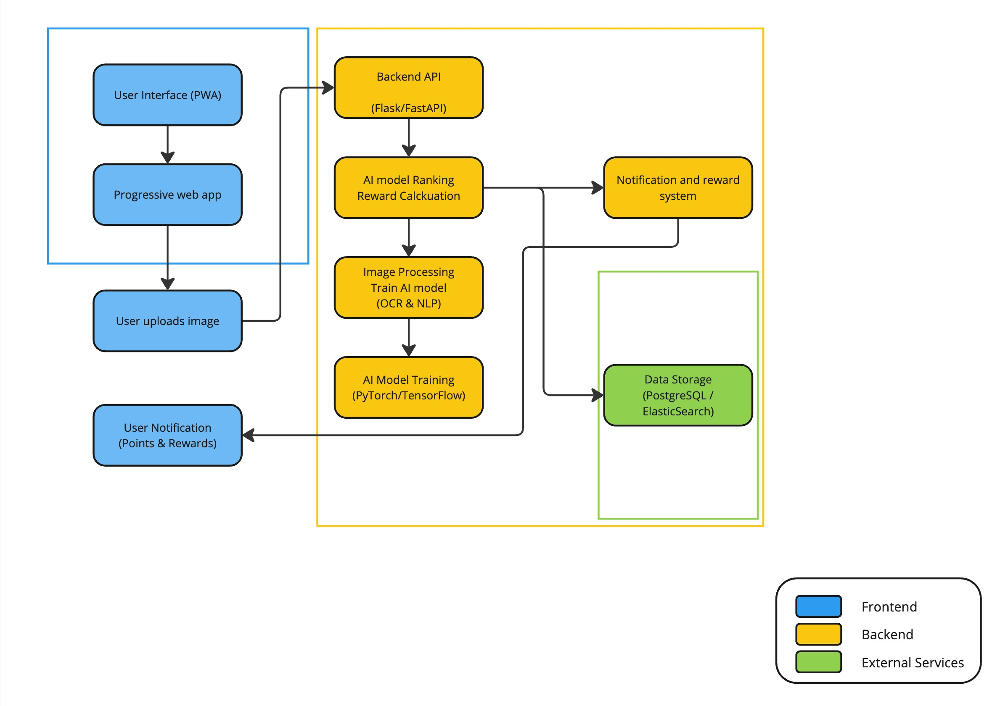

===============================
System Architecture Overview
===============================

The Only Menu system is designed to be a lightweight, scalable, and user-friendly tool for crowdsourcing restaurant menu data. The architecture is built around a Progressive Web App (PWA) and a flexible backend capable of handling AI-based image processing.

**Data Flow Overview:**

1. **User Interaction**: Users upload menu images via the PWA.
2. **Backend Processing**: The backend API receives the image, which is processed by the AI model.
3. **AI Processing**: The AI model extracts relevant data and ranks the image.
4. **Data Storage**: The extracted data is stored in the database.
5. **User Reward**: The system calculates and awards points to the user.
6. **Notification**: Users are notified of their points and can redeem rewards.

**Core Components:**

- **Frontend (PWA)**: Built with React.js/Vue.js for a responsive and intuitive user experience.
- **Backend API**: FastAPI/Flask for Python backends, or Express.js for Node.js backends.
- **AI Processing**: Utilizes TensorFlow/Tesseract for OCR and NLP.
- **Data Storage**: PostgreSQL and Elasticsearch for efficient data management.
- **Notification System**: Django Celery or Node.js Bull for managing user notifications and rewards.

**System Boundaries:**

- **Frontend**: The user-facing part of the system, including the PWA and notification system.
- **Backend**: The core logic and processing components, including the API, AI model, and reward calculation.
- **External Services**: Third-party tools and databases used for storage and additional processing.

For more detailed information, please refer to the individual component sections.
