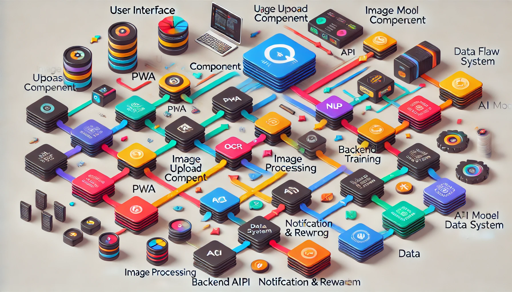

======================================
Data Flow and User Journey Overview
======================================

This section provides a detailed explanation of the data flow within the Only Menu system, including the user journey, system boundaries, and how different components interact. This documentation is organized into clear sections to facilitate understanding.

Introduction
=============

The Only Menu system is designed to crowdsource restaurant menu data by allowing users to upload images of menus, which are then processed by an AI model. This system prioritizes simplicity, user engagement, and efficient data processing to ensure a seamless experience for both users and administrators.

----------------------
User Journey
----------------------

1. **Visit & Discover**

   A user visits a restaurant and discovers the Only Menu application, which can be accessed via a Progressive Web App (PWA). The app's intuitive interface prompts the user to upload a picture of the restaurant's menu.

2. **Image Upload**

   The user clicks on the image upload button and selects or takes a picture of the menu using their mobile device. The image is immediately uploaded to the Only Menu backend for processing.

3. **AI Processing**

   The uploaded image is received by the backend API, which forwards it to the AI processing pipeline. This pipeline includes Optical Character Recognition (OCR) and Natural Language Processing (NLP) models to extract relevant information from the menu image.

4. **Data Extraction & Ranking**

   The AI model extracts text from the menu image, categorizes the data, and ranks the upload based on the quality and quantity of information extracted. This ranking determines the number of points the user will earn.

5. **User Reward**

   The system calculates the user's reward based on the AI ranking and updates their points balance. Users are notified of their reward through the app, where they can also track their total points and redeem them for rewards.

6. **Data Storage**

   The processed data is stored in a relational database, ensuring it is available for future searches, updates, or analysis. This data contributes to refining the AI model over time.

----------------------
System Boundaries
----------------------

The system is divided into three main areas:

1. **Frontend (User-Facing)**

   - **User Interface (PWA)**: The user-facing component that handles all interactions with the user, from image uploads to reward notifications.
   - **Image Upload Component**: A crucial part of the frontend that facilitates the seamless upload of menu images.

2. **Backend (Core Processing)**

   - **Backend API**: Acts as the intermediary between the frontend and the core processing logic. Handles incoming requests, image processing, and interaction with the database.
   - **Image Processing (OCR & NLP)**: Processes the uploaded images to extract and categorize menu data.
   - **AI Model Training**: Continuously improves the AI model using new data, enabling better extraction and ranking over time.

3. **External Services & Tools**

   - **Data Storage**: Utilizes PostgreSQL for relational data management and Elasticsearch for fast search capabilities.
   - **Notification & Reward System**: Manages notifications and rewards, possibly integrating with third-party services for enhanced functionality.

----------------------
Detailed Component Interaction
----------------------

1. **Frontend to Backend Communication**

   - **PWA to Backend API**: When the user uploads an image, the PWA sends the image file to the Backend API. This interaction is facilitated by RESTful API calls, ensuring a smooth data exchange.

2. **Backend Processing**

   - **API to Image Processing**: The Backend API sends the image to the AI processing pipeline, where OCR and NLP models extract the necessary information.
   - **Image Processing to AI Model**: The AI model ranks the image based on the extracted data. This ranking is used to determine the user’s reward.

3. **Data Storage & User Notification**

   - **AI Model to Data Storage**: Extracted and ranked data is stored in a relational database. The database is structured to allow fast retrieval and updating of menu data.
   - **Backend to Notification System**: Once the data is processed and stored, the backend triggers the notification system, informing the user of their points and available rewards.

For further details on the individual components, please refer to the :doc:`components` section. To understand the technologies and tools used, see the :doc:`oss_third_party` section.

----------------------
Caveats and Considerations
----------------------

While the system is designed for efficiency and user engagement, there are several challenges that developers must be aware of. These include the accuracy of AI models, user retention strategies, and scalability concerns. For a deeper dive into these issues, refer to the :doc:`caveats` section.

