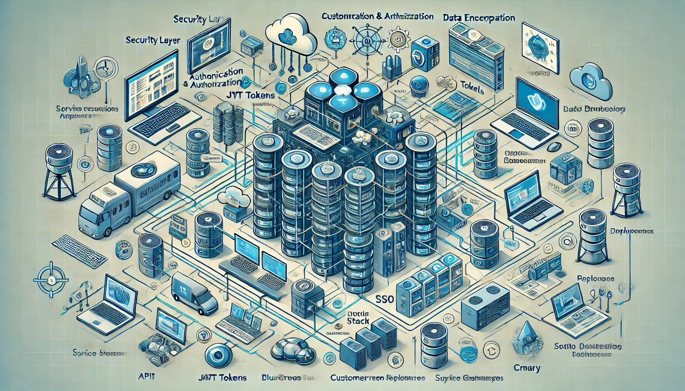

==============================
System Architecture
==============================

This section provides an in-depth look at the overall system architecture, detailing the components, their interactions, and the design principles that guide the system.

.. figure:: _static/basic_workflow.png
   :alt: Basic Flow Diagram

   Basic Flow Diagram

Below is an index of the various sub-sections that detail the different aspects of this system.

.. toctree::
   :maxdepth: 2
   :caption: Contents:

    workflows/pr_size_label
    workflows/deploy-application-docs

**Overview:**

The system is built on a microservices architecture, enabling flexibility, scalability, and independent development of components. Each microservice is designed to handle a specific business function, and the services communicate through well-defined APIs.

**Key Components:**

1. **API Gateway:**
   - Acts as a single entry point for all client requests.
   - Routes requests to the appropriate backend microservices.
   - Handles cross-cutting concerns such as authentication, logging, and rate limiting.

2. **Frontend:**
   - **React.js** for building user interfaces.
   - The frontend is designed to be white-labeled, allowing on-the-fly customization.
   - It communicates with the backend via RESTful APIs and WebSockets for real-time updates.

3. **Backend Microservices:**
   - **Authentication Service:**
     - Manages user authentication and authorization using OAuth2.0/JWT.
     - Interacts with the database to manage user credentials and tokens.
   - **Order Management Service:**
     - Handles the creation, processing, and tracking of orders.
     - Integrates with payment gateways and inventory management systems.
   - **Manufacturing Line Service:**
     - Manages the workflow of manufacturing processes.
     - Provides real-time monitoring and control of production lines.
   - **Inventory Management Service:**
     - Tracks inventory levels, updates stock, and triggers reordering.
     - Sends notifications when stock levels fall below a certain threshold.
   - **Analytics Service:**
     - Collects and processes data from various services.
     - Provides insights and reports through a dashboard.

4. **Databases:**
   - **PostgreSQL:** Relational database used for storing structured data such as user information, orders, and inventory.
   - **MongoDB:** NoSQL database used for storing unstructured data such as logs, product catalog, and other dynamic content.

5. **Event-Driven Architecture:**
   - **Kafka:** Manages asynchronous tasks and event-driven workflows between microservices.
   - Events are used to decouple services and ensure scalability.

6. **Containerization and Orchestration:**
   - **Docker:** Each microservice is containerized, ensuring consistency across development and production environments.
   - **Kubernetes:** Orchestrates container deployment, scaling, and management across multiple environments.

7. **External Integrations:**
   - **Payment Gateways:** Integration with third-party payment providers for processing transactions.
   - **CRM Systems:** Syncs customer data and interactions with external CRM platforms.
   - **Shipping Providers:** Automates the shipping process by integrating with external logistics providers.

**Communication Between Services:**

- **RESTful APIs:** Synchronous communication between frontend and backend services.
- **gRPC/Protobuf:** Efficient communication between backend services where low latency is required.
- **WebSockets:** Enables real-time communication for features like live order tracking and manufacturing line monitoring.
- **Message Queues:** Kafka is used for event-driven communication, ensuring reliable processing of asynchronous tasks.

**Security Architecture:**

- **Authentication:** OAuth2.0 and JWT are used for secure user authentication and authorization.
- **Data Encryption:** All sensitive data is encrypted in transit (using TLS/SSL) and at rest.
- **Role-Based Access Control (RBAC):** Ensures that users have appropriate permissions based on their roles.

**High Availability and Scalability:**

- **Auto-Scaling:** Kubernetes handles auto-scaling of microservices based on load.
- **Load Balancing:** NGINX or AWS Elastic Load Balancing (ELB) is used to distribute traffic evenly across multiple instances.
- **Failover Mechanisms:** Redundancy is built into the system to ensure high availability in case of failures.

**Deployment and CI/CD:**

- **CI/CD Pipeline:** Automated deployment using GitHub Actions or Jenkins, ensuring that code changes are tested and deployed seamlessly.
- **Infrastructure as Code (IaC):** Terraform is used to manage and provision infrastructure resources.

**Monitoring and Logging:**

- **Prometheus:** Used for monitoring system performance and health.
- **Grafana:** Provides dashboards for visualizing performance metrics.
- **ELK Stack (Elasticsearch, Logstash, Kibana):** Centralized logging and log analysis.

**Extensibility and Modularity:**

- The system is designed to be modular, allowing for easy addition of new services or modification of existing ones without impacting the overall architecture.
- APIs are versioned to maintain backward compatibility.

**References:**

- `React Documentation <https://reactjs.org/docs/getting-started.html>`_
- `PostgreSQL Documentation <https://www.postgresql.org/docs/>`_
- `Kubernetes Documentation <https://kubernetes.io/docs/>`_
- `Kafka Documentation <https://kafka.apache.org/documentation/>`_

**Diagrams:**

   System Architecture Diagram
